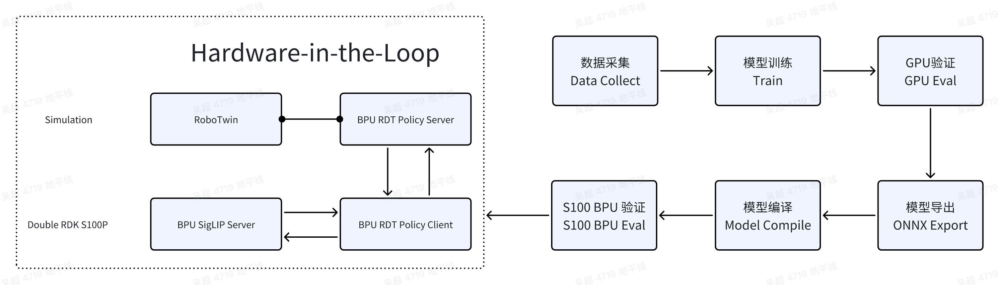

English | [简体中文](./README_cn.md)

[English](./README.md) | 简体中文

```
GitHub: https://github.com/WuChao-2024/RDK_RoboticsDiffusionTransformers_Tools
FeiShu Document: https://horizonrobotics.feishu.cn/docx/IRVLdawAUoUAoUxNJv7cGlM4nHg
D-Robotics Developer Community NodeHub CN: 
D-Robotics Developer Community NodeHub EN: 
```
```
Contributors: 
- Cauchy @吴超
- SkyXZ @熊旗
```

[Video bilibili](https://www.bilibili.com/video/BV17zh9zLEXd)

[Video Youtube](https://youtu.be/jYbSUjFiFik?si=UPY1CCWs7IwCdFyZ)



## Introduction
This article introduces how to reproduce the 170M parameter RDT (Robotics Diffusion Transformers) end-to-end VLA large model for robotic dexterous manipulation, based on the RoboTwin2 simulation environment and the RDK S100 series robot development kit.

## Advantages and Highlights of the Solution
1. **End-to-End Workflow**: Includes complete steps from data collection, model training, GPU validation, model export, model compilation, to BPU validation. This full RDT solution is implemented using the RoboTwin2 simulation environment, eliminating the complexity of hardware-based reproduction. The solution is also implemented on an 8-GPU A100 server with relatively low configuration, making it easy to reproduce. When inconsistencies occur in real hardware—such as numerical discrepancies, behavioral differences, or mismatched dataset structures—this reproducible pure-software workflow can be used to compare each step individually.
2. **Highly Encapsulated BPU Project**: A single Python program prepares all required ONNX models, calibration data (both single-input and multi-input), YAML files, config files, and bash compilation scripts. After exporting, you only need to mount all prepared files into the toolchain Docker container to obtain all necessary BPU models and files needed to run on the RDK S100P.
3. **Hardware-in-the-Loop**: If you have already reproduced RDT on industrial PCs or NVIDIA Jetson devices, the BPU RDT model is encapsulated using the standard RoboTwin Server-Client architecture, supporting invocation via HTTP requests. By simply connecting an Ethernet cable, you can quickly validate the algorithmic performance of the BPU-accelerated RDT model without modifying hardware connections.
Content cannot be displayed outside Feishu documents at this time

## Performance Data
1. All RDK S100P devices are in optimal condition: CPU: 6 × A78AE @ 2.0 GHz, BPU: 1 × Nash-m @ 1.5 GHz, 128 TOPS @ int8
2. Testing involved locally looping 300 sets of data. All S100P units were under continuous load during testing. In actual operation, action chunks are not inferred, placing the S100P in idle state; only during end-to-end inference does the load reach the levels described in the table.
3. CPU usage and CPU memory usage were monitored using the `htop` command. BPU usage, ION memory usage, and DDR bandwidth usage were monitored using the `hrt_ucp_monitor -d 3000` command.
4. End-to-end latency refers to the time taken from inputting 6 image observations and all joint angle data into the model until obtaining the RDT model's prediction of joint angles for the next 64 timesteps. End-to-end similarity is calculated by comparing results from full BPU model inference against GPU model inference. Input data passes through all BPU models, and cosine similarity is computed on the final predicted 64-timestep data from the RDT model.

|  | Single S100P Inference <br/> (RDT - 170M) | Dual S100P Inference (Master) <br/> (RDT - 170M) | Dual S100P Inference (Slave) <br/> (RDT - 170M) |
|--|--|--|--|
| End-to-End Latency | 2.160 seconds | 1.630 seconds | - |
|CPU Usage (Max 100%)|8%|12 %| 2 %|
|CPU Memory Usage |0.6 GB| 0.7 GB |0.1 GB |
|BPU Usage (Max 100%) |100% |100%|40 %|
|ION Memory Usage|1.4GB|1.5 GB|0.9 GB|
|DDR Bandwidth Usage|30GB / s|31 GB / s|14 GB / s|
|End-to-End Cosine Similarity|0.9998|0.9998|-|

## Success Rate Data
In the RoboTwin2 ENV, both environmental states and language instructions contain random elements in the code. Although random seeds have been fixed, we still observed fluctuations in success rates across multiple evaluations. The values recorded here represent the maximum success rate observed over multiple evaluations.

| Task Name | Success Rate <br/> (GPU) | Success Rate <br/> (BPU)| BPU / GPU |
|---|---|---|---|
| blocks_ranking_rgb    | 0.14 | 0.07 |  50.00 % |
| click_bell            | 0.61 | 0.36 |  59.02 % |
| dump_bin_bigbin       | 0.85 | 0.79 |  92.94 % | 
| move_stapler_pad      | 0.19 | 0.10 |  52.63 % |
| place_a2b_left        | 0.26 | 0.20 |  76.92 % |
| place_cans_plasticbox | 0.13 | 0.15 | 115.38 % |
| place_container_plate | 0.81 | 0.93 | 114.81 % | 
| place_object_stand    | 0.41 | 0.42 | 102.44 % |
| put_bottles_dustbin   | 0.53 | 0.31 |  58.49 % |
| shake_bottle          | 0.98 | 0.96 |  97.96 % |


## Environment Setup

### Development Machine
Reference environment and configuration for the development machine:
```
Ubuntu 22.04, Python 3.10.12, CUDA 12.4, OpenExplore 3.2.0
CPU: Intel(R) Xeon(R) Platinum 8350C, 52 Cores 112 Threads
GPU: 8 × NVIDIA A100-SXM4-40GB
RAM: 1024 GB | Disk: 963 TB
```
1. RoboTwin-2.0 environment installation: https://robotwin-platform.github.io/doc/usage/robotwin-install.html
2. RoboTwin-2.0 RDT environment installation: https://robotwin-platform.github.io/doc/usage/RDT.html
3. RDK S100 OpenExplore Toolchain Access: https://developer.d-robotics.cc/rdk_doc/rdk_s/Advanced_development/toolchain_development/overview

### Development Board
Reference environment and configuration for the development board (optional dual S100P collaborative inference):
```
RDK OS 4.0.2-Beta Based on Ubuntu 22.04, Python 3.10.12, OpenExplore 3.2.0
CPU: 6 × A78AE @ 2.0GHz
DDR: 12GB LPDDR5 @ MT/s, 96-bit
BPU: 1 × Nash-m @ 1.5GHz, 128 TOPs @ int8
GPU: 1 × Arm Mali-G78AE,  100 GFLOPS @ FP32
MCU: 4 × Arm Cortex-R52+ @ 1.2GHz
```
1. Compile on the board the high-performance BPU Python interface libpyCaychyKesai.so designed for the RDT embodied model. The corresponding commit id is: 6db363bf6a2ef77faa4aeafc378ebf7bc045020b. Refer to the documentation link: https://github.com/WuChao-2024/pyCauchyKesai/blob/6db363bf6a2ef77faa4aeafc378ebf7bc045020b/README_cn.md
Steps include: Obtain the corresponding version of UCP dynamic library and header files from the OpenExplore package, replace the onboard dynamic library and header files, compile the interface, move the libpyCauchyKesai.so dynamic library to a location where the Python interpreter can locate it, then verify.
```
$ python3 -c "from libpyCauchyKesai import __version__ ;print(__version__)"
[UCP]: log level = 3
[UCP]: UCP version = 3.7.4
[VP]: log level = 3
[DNN]: log level = 3
[HPL]: log level = 3
[UCPT]: log level = 6
0.0.7
```

2. Install the board-side inference environment according to the requirements listed in the RDT_RoboticsDiffusionTransformers_Tools repository.
Dependencies for the board are packaged for download; refer to relevant links for usage documentation.

## Step One: Data Collection (Data Collect)

### Clean Scene Data Collection Example

We use the common Adjust Bottle task as an example. From the documentation describing this task, we see that the Aloha-AgileX robotic arm achieves a success rate around 93%. Therefore, we choose this dual-arm platform for data collection. Since we are initially collecting clean environment data, we disable all domain_randomization configurations. Thus, the config used for data collection is as follows:
```
render_freq: 0
episode_num: 300
use_seed: false
save_freq: 15
embodiment:
- aloha-agilex
language_num: 100
domain_randomization:
  random_background: false
  cluttered_table: false
  clean_background_rate: 1
  random_head_camera_dis: 0
  random_table_height: 0
  random_light: false
  crazy_random_light_rate: 0
camera:
  head_camera_type: D435
  wrist_camera_type: D435
  collect_head_camera: true
  collect_wrist_camera: true
data_type:
  rgb: true
  third_view: false
  depth: false
  pointcloud: false
  observer: false
  endpose: false
  qpos: true
  mesh_segmentation: false
  actor_segmentation: false
pcd_down_sample_num: 1024
pcd_crop: true
save_path: ./clean_data
clear_cache_freq: 5
collect_data: true
eval_video_log: true
```
First, enter the root directory of the RoboTwin project, create a new YAML configuration file under the task_config directory to save the above data collection parameters. For ease of identification and management, name it RDKS100_Clean. Then, run the following command in the project root directory to start data collection:
```
conda activate RoboTwin
bash collect_data.sh adjust_bottle RDKS100_Clean 0
```
The appearance of logs similar to the following indicates normal data collection:
```
(RoboTwin) qi.xiong@instance-qih2207m:~/DualArm/RoboTwin$ bash collect_data.sh adjust_bottle demo_clean 4
Render Well
============= Config =============

Messy Table: False
Random Background: False
Random Light: False
Random Table Height: 0
Random Head Camera Distance: 0
Head Camera Config: D435, True
Wrist Camera Config: D435, True
Embodiment Config: aloha-agilex

==================================
Task Name: adjust_bottle
[Start Seed and Pre Motion Data Collection]
simulate data episode 0 success! (seed = 0)
```

You will then see the collected data appear in the project root directory, with the specific file structure as follows:
```
(RoboTwin) qi.xiong@instance-qih2207m:~/DualArm/RoboTwin/clean_data/adjust_bottle$ tree -L 2
.
└── RDKS100_Clean
    ├── data             # Trajectory data folder
    ├── instructions     # Task instruction folder
    ├── scene_info.json  # Scene information file
    ├── seed.txt         # Successful seed file
    ├── _traj_data       # Raw trajectory data cache
    └── video            # Data collection visualization video folder
5 directories, 2 files
```
Besides adjust_bottle, other commands can be referenced from the RoboTwin documentation to collect data for different scenes and tasks.

### RoboTwin to RDT Training Data Conversion
Next, convert the collected data to adapt to the HDF5 format required by RDT for training. RoboTwin has already provided conversion code for this part. Simply run the following command, where task_name is the task name needing conversion, corresponding to the task name collected earlier; task_config corresponds to the data collection configuration file mentioned above; expert_data_num is the number of data entries we want to export—we collected 300 data points, so we can choose to export 300 or 100 based on actual conditions; gpu_id is the GPU-ID we select for the data conversion process.
```
# Process data, converting obtained expert data into RDT training data format
cd policy/RDT/
mkdir processed_data && mkdir training_data
bash process_data_rdt.sh ${task_name} ${task_config} ${expert_data_num} ${gpu_id}
```

Then generate the RDT training parameter configuration file. Use the following command, where model_name is the name we wish to assign to our model. The generated configuration file will be saved in ./robotwin/policy/RDT/model_config/. Within it, configure training parameters such as train_batch_size, sample_batch_size, cuda_visible_device, etc. Specific configuration descriptions are as follows:
```
cd policy/RDT
bash generate.sh ${model_name}
```

```
# Model configuration name, used to identify the current training configuration
model: RDT_S100_Clean
# Training data path, pointing to the directory containing HDF5-formatted trajectory data
data_path: training_data/RDT_S100_Clean
# Model checkpoint save path, model weights will be saved periodically during training
checkpoint_path: checkpoints/RDT_S100_Clean
# Pre-trained model path, fine-tuning using RDT-1B as the base model
pretrained_model_name_or_path: ../weights/RDT/rdt-1b
# Used GPU-ID
cuda_visible_device: '0,1,2,3,4,5,6,7'
# Training batch size, number of samples per GPU = train_batch_size // cuda_visible_device
train_batch_size: 16
# Test batch size
sample_batch_size: 32
# Maximum training steps, total training for 20,000 steps
max_train_steps: 20000
# Checkpoint saving period, save model weights every 2500 steps
checkpointing_period: 2500
# Sampling period, perform trajectory sampling every 100 steps to evaluate model performance
sample_period: 100
# Total checkpoint limit, maximum of 40 checkpoint files saved
checkpoints_total_limit: 40
# Learning rate, set to 0.0001 for model fine-tuning
learning_rate: 0.0001
# DataLoader worker processes count, use 8 processes for parallel data loading
dataloader_num_workers: 8
# State noise SNR, add 40dB noise to state data to enhance robustness
state_noise_snr: 40
# Gradient accumulation steps, perform gradient update every 1 step
gradient_accumulation_steps: 1
```
Then copy the training data we need from processed_data into the training_data/${model_name} directory. Directly copy in however many tasks' data you have.
```
training_data/${model_name}
├── ${task_1}
│   ├── episode_0
|   |   |── episode_0.hdf5
|   |   |-- instructions
|   │   │   ├── lang_embed_0.pt
|   │   │   ├── ...
├── ${task_2}
│   ├── ...
├── ...
```

## Step Two: Model Training (Train) 
After completing dependency installation, we also need to download the pre-trained RDT model. This part is simple; follow the steps below. If your server or computer lacks proxy configuration, download speed may be very slow. In such cases, simply enter the following in the terminal to automatically use HuggingFace's mirror:
```
export HF_ENDPOINT=https://hf-mirror.com
```
Then execute the following commands sequentially to complete the pre-trained model download:
```
# step1: Enter the policy root directory of RoboTwin and create the RDT weights path
mkdir -p policy/weights/RDT && cd policy/weights/RDT
# step2: Download the 1b model sequentially
huggingface-cli download google/t5-v1_1-xxl --local-dir t5-v1_1-xxl
huggingface-cli download google/siglip-so400m-patch14-384 --local-dir siglip-so400m-patch14-384
huggingface-cli download robotics-diffusion-transformer/rdt-170m --local-dir rdt-170m
```
The default integrated RDT in RoboTwin and the default configuration in the original RDT repository is the 1B DiT model. To train the 170M version of RDT, some modifications are needed. First, modify the model parameter configuration. Enter the RoboTwin/policy/RDT/configs path, find the base.yaml file. The lang_token_dim, depth, and hidden_size of the 170M model are half those of the 1B model. Therefore, make the following modifications to the RDT class in the model:
```
rdt:
    # 1B: num_head 32 hidden_size 2048
    # 170M: num_head 32 hidden_size 1024 depth 14
    hidden_size: 1024
    depth: 14
    num_heads: 32
    cond_pos_embed_type: multimodal 
```

After completing the model configuration modification, proceed to generate our training configuration.

```
cd policy/RDT
bash generate.sh ${model_name}
```
Then copy the required training data from processed_data into the training_data/${model_name} directory. Copy in however many tasks' data you have. Next, enter the generated configuration file and modify the pre-trained model path to point to the downloaded RDT-170M mentioned above. Then modify our training batch and GPU-ID accordingly:
```
# Generated on 2025-08-03 01:35:52
model: RDT170M_10Tasks
data_path: training_data/RDT170M_10Tasks
checkpoint_path: checkpoints/RDT170M_10Tasks
pretrained_model_name_or_path: ../weights/RDT/rdt-170m
cuda_visible_device: '4,5,6,7'
train_batch_size: 16
sample_batch_size: 32
max_train_steps: 20000
checkpointing_period: 2500
sample_period: 100
checkpoints_total_limit: 40
learning_rate: 0.0001
dataloader_num_workers: 8
state_noise_snr: 40
gradient_accumulation_steps: 1
```
After configuration, input the following command to start fine-tuning:
```
bash finetune.sh ${model_name}
```

### Step Three: GPU Validation (GPU Eval)
Accuracy evaluation on the development machine's GPU is straightforward, as RoboTwin has already adapted for this. Simply input the following command to automatically start evaluation in the simulation environment. Specifically, task_name is the task name needing evaluation; task_config is our configuration for the simulation environment, consistent with the file used during data collection—we can directly use the data collection configuration file or customize a new one for evaluation; model_name is the model name we assigned earlier; checkpoint_id is the checkpoint we need to use—simply input the specific ID here; seed is the seed used during evaluation; gpu_id is the GPU-ID used during evaluation:
```
bash eval.sh ${task_name} ${task_config} ${model_name} ${checkpoint_id} ${seed} ${gpu_id}
```

Upon successful execution, RoboTwin will automatically evaluate the specified number of times in the configuration file and calculate the average success rate. After evaluation, you can find the success rate for this round of task evaluation in a file located in a directory like `eval_result/adjust_bottle/RDT/demo_clean/RDT170M_10Tasks/2025-08-26_10:18:01/_result.txt`.
Complete accuracy and performance data refer to the Introduction section at the beginning of this document.


## Step Four: Model Export (ONNX Export) 
Run the export_all.py one-click export script in the RoBoTwin directory. This script helps you export several ONNX models, prepare calibration data, yaml configuration files needed for compilation, json configuration files, bash compilation scripts, and also prepares language instructions from the training set along with their embedding tensors.
The script's GitHub repository path is: `https://github.com/WuChao-2024/RDK_RoboticsDiffusionTransformers_Tools/blob/develop/export_all.py`
In the main() function of the program, there are several configurable items.
```
parser.add_argument('--export_path', type=str, default="rdt_export_ws", help="")
parser.add_argument('--config_path', type=str, default="policy/RDT/configs/base.yaml", help="")
parser.add_argument('--pretrained_vision_encoder', type=str, default="policy/weights/RDT/siglip-so400m-patch14-384", help="")
parser.add_argument('--pretrained_model', type=str, default="policy/BPU_RDT/checkpoints/RDT170M_10Tasks/checkpoint-22500/pytorch_model/mp_rank_00_model_states.pt", help="")
parser.add_argument('--train_data', type=str, default="policy/RDT/processed_data", help="")
parser.add_argument('--num_samples', type=int, default=100, help="")
parser.add_argument('--jobs', type=int, default=8, help="")
parser.add_argument('--optimized_level', type=str, default="O2", help="")
parser.add_argument('--ctrl_freq', type=int, default=25, help="")
parser.add_argument('--left_arm_dim', type=int, default=6, help="")
parser.add_argument('--right_arm_dim', type=int, default=6, help="")
parser.add_argument('--cal_data_device', type=str, default='cuda', help="")
```
Among these:
1. --export_path: Folder for all exported artifacts, also the folder mounted into Docker during Model Compile. This folder contains the following content.
```
  a. build_all.sh script, the script to launch BPU model compilation inside Docker.
  b. DiT_WorkSpace and img_adaptor_WorkSpace folders, called by the build_all.sh script, mounted into the Docker environment to generate BPU models for these two parts.
  c. BPU_RDT_Policy folder, the pre-generated final BPU artifact folder. At this stage, besides weights stored in BPU models, there are some scattered model weights. CPU inference is fast enough, so we choose to directly use ONNXRuntime for inference.
  d. instructions folder, storing language instructions and their embeddings. Language instructions are generated from templates pre-configured in the RoboTwin environment, and language instruction embeddings are generated by the t5 model. In practical use, selecting one effective instruction as a Prompt is sufficient. However, please note that during the BPU Eval phase in RoboTwin, randomly generated language instructions and their embeddings are used for evaluation to avoid scenarios where identical instructions lead to 100% or 0% success rates.
  e. test_data folder, saving end-to-end input and output data for comparing data consistency between the board-side BPU model's end-to-end input and output.
```
```
.
├── build_all.sh
├── DiT_WorkSpace
│   ├── build.sh
│   ├── config.yaml
│   ├── quant_config.json
│   ├── rdt_dit.onnx
│   └── rdt_dit_calibration
│       ├── freq
│       ├── img_c
│       ├── lang_c
│       ├── lang_mask
│       ├── t
│       └── x
├── img_adaptor_WorkSpace
│   ├── build.sh
│   ├── config.yaml
│   ├── rdt_image_adaptor.onnx
│   └── rdt_image_adaptor_calibration
├── BPU_RDT_Policy
│   ├── base.yaml
│   ├── rdt_lang_adaptor.onnx
│   ├── rdt_state_adaptor_1x1x256.onnx
│   └── rdt_state_adaptor_1x64x256.onnx
├── instructions
│   ├── adjust_bottle-demo_clean-300
│   │   ├── Grab_the_medium-sized_green_bottle_and_lift_it_upright__.pt
│   │   ├── Lift_the_red-capped_bottle_off_the_table_and_hold_it_upright.__.pt
│   │   └── Position_the_narrow-necked_bottle_head-up_and_lift_it__.pt
│   ├── place_dual_shoes-demo_clean-300
│   │   └── Grab_both_the_red_sneaker,_ensure_tips_left,_place_in_the_smooth_bright_orange_box.__.pt
│   └── place_empty_cup-demo_clean-300
│       ├── Use_an_arm_to_place_the_cup_with_smooth_plastic_surface_on_the_round_coaster_with_light_streaks__.pt
│       └── Use_the_arm_to_position_the_smooth_blue_drinking_cup_onto_the_grainy_texture_coaster.__.pt
└── test_data
    ├── ... ...
    ├── 9_actions.npy
    ├── 9_cam_high_0.npy
    ├── 9_cam_high_1.npy
    ├── 9_cam_left_wrist_0.npy
    ├── 9_cam_left_wrist_1.npy
    ├── 9_cam_right_wrist_0.npy
    ├── 9_cam_right_wrist_1.npy
    ├── 9_joints.npy
    └── 9_lang_embeddings.pt
```
2. config_path: Configuration file for the RDT model structure. This is prepared during RDT model training and should remain consistent with training. The purpose of calling this model internally in the program is to load a PyTorch nn.Module type model identical to training for forward propagation to save calibration data and export ONNX models.
3. pretrained_vision_encoder: Path to the pre-trained vision encoder weights, here being the path to the huggingface SigLIP model.
4. pretrained_model: Training generates many types of RDT weights. Here, we only need the mp_rank_00_model_states.pt weight.
5. train_data: Training data directory, used here to generate calibration data. The program traverses each folder within, corresponding to each task type, then randomly extracts calibration data.
```
--train_data example:
.
├── adjust_bottle-demo_clean-300
│   ├── episode_0
│   │   ├── episode_0.hdf5
│   │   └── instructions
│   ├── episode_1
│   │   ├── episode_1.hdf5
│   │   └── instructions
...
├── place_dual_shoes-demo_clean-300
│   ├── episode_0
│   │   ├── episode_0.hdf5
│   │   └── instructions
...
└── place_empty_cup-demo_clean-300
    ├── episode_0
    │   ├── episode_0.hdf5
    │   └── instructions
...
```
6. num_samples: Number of calibration data samples randomly extracted per task type, default 100.
7. jobs: Number of threads during toolchain model compilation, default 8.
8. optimized_level: Optimization level during toolchain model compilation, maximum O2, default O2.
9. ctrl_freq, left_arm_dim, right_arm_dim: Model-related configuration items, keep consistent with training.
10. cal_data_device: Device selection for generating calibration data, default cuda, i.e., using GPU to generate calibration data.


## Step Five: Model Compilation (Model Compile)@吴超 
Here, we use the standard delivery docker environment of the algorithm toolchain to complete BPU model quantization and compilation. Refer to the following code block for the docker mount command.
```
[sudo] docker run [--gpus all] -it -v <BPU_Work_Space>:/open_explorer REPOSITORY:TAG
```
Where:
- sudo is optional. Sometimes our docker installation options differ, so choose whether to use sudo based on actual circumstances.
- --gpus all is the parameter required to mount GPU Docker. For CPU Docker, this parameter is not needed. In X5's PTQ scheme, CPU Docker is used; only QAT schemes require GPU Docker. In S100's PTQ scheme, GPU Docker uses CUDA to accelerate the forward propagation calibration phase, though CPU Docker can also fully utilize the PTQ scheme.
- <BPU_Work_Space> needs to be replaced with the path you want to mount into Docker, here being the path to your exported BPU workspace. Note: absolute paths must be used.
- REPOSITORY:TAG needs to be filled according to the name and version number of the Docker container you downloaded. Use the docker images command to confirm.
Note:
This only provides a reference mounting method. Actually, you can use any method you prefer to use Docker software. If you have other questions, please refer to the Docker official documentation.

Then run the one-click compilation script. Compilation time depends on the calibration dataset size and computer configuration. With GPU-accelerated compilation and 300 calibration data entries, it takes approximately 20 minutes.
```
bash build_all.sh
```
After completion, the BPU_RDT_Policy directory will generate all artifacts required for RDK S100 BPU deployment
```
BPU_RDT_Policy
.
|-- base.yaml
|-- rdt_dit.hbm
|-- rdt_img_adaptor.hbm
|-- rdt_lang_adaptor.onnx
|-- rdt_state_adaptor_1x1x256.onnx
`-- rdt_state_adaptor_1x64x256.onnx
```

## Step Six: S100 BPU Validation (BPU Eval)
In the RoboTwin working directory, in the policy/RDKS100_RDT directory, prepare these files from the GitHub repository, essentially creating a new Policy. The corresponding URL in the GitHub repository is: `https://github.com/WuChao-2024/RDK_RoboticsDiffusionTransformers_Tools/tree/develop/RDKS100_RDT`
```
.
├── __init__.py
├── deploy_policy.py
├── deploy_policy.yml
├── eval.sh
└── server_client.py
```
On the board side, besides placing the compiled model folder from the Model Compile phase onto the board, prepare the following working directory and install the development board environment as per the Installation section of this document. The corresponding URL in the GitHub repository is: `https://github.com/WuChao-2024/RDK_RoboticsDiffusionTransformers_Tools/tree/develop/board`
```
.
|-- BPU_RDT_Policy     # BPU Weights
|-- BPU_RDT_Policy.py  # BPU Model
|-- client.py
|-- friend_server.py
|-- server_client.py
`-- requirements.txt
```

### Single S100 Inference
In the deploy_policy.py file of the RoboTwin environment, specify the server's open port; others can remain default.
```
class RDKS100_RDT_Server:
    def __init__(self):
        self.server = Server(host='0.0.0.0', port=50023)
In the S100's client.py file, change the IP to the server's IP and the port to the server's port. Other parameters should remain consistent with GPU accuracy evaluation.
    parser.add_argument('--bpu_rdt_path', type=str, default='./BPU_RDT_Policy/', help='') 
    # example: $ tree BPU_RDT_Policy
    # .
    # |-- base.yaml
    # |-- bpu_siglip_so400m_patch14_nashm_384x384_featuremaps.hbm
    # |-- rdt_dit.hbm
    # |-- rdt_img_adaptor.hbm
    # |-- rdt_lang_adaptor.onnx
    # |-- rdt_state_adaptor_1x1x256.onnx
    # `-- rdt_state_adaptor_1x64x256.onnx
    parser.add_argument('--host', type=str, default='10.112.20.37', help='')
    parser.add_argument('--port', type=int, default=50023, help='')
    parser.add_argument('--ctrl_freq', type=int, default=25, help="")
    parser.add_argument('--left_arm_dim', type=int, default=6, help="")
    parser.add_argument('--right_arm_dim', type=int, default=6, help="")

```
Then start evaluation and the board's client side in order, otherwise same as GPU accuracy evaluation.

```
# RoboTwin
cd policy/RDKS100_RDT
bash eval.sh place_cans_plasticbox aloha-agilex-m0_b0_l0_h0_c0_D435 1 0

# RDK S100
python3 client.py
```

### Dual S100 Collaborative Inference
On the second S100, run the friend_server.py program. In the first S100's client.py program, modify the model instantiation method.
SERVER_URL is changed to the IP address of the second S100, others remain consistent with single S100 inference.
```
# bpu_model = BPU_RDT_Policy(opt.bpu_rdt_path, config_base_yaml, SERVER_URL = None)
bpu_model = BPU_RDT_Policy(opt.bpu_rdt_path, config_base_yaml, SERVER_URL = 'http://10.64.60.208:5000/process')
```
This completes all steps. Accuracy and performance data refer to the Introduction section at the beginning of this document.